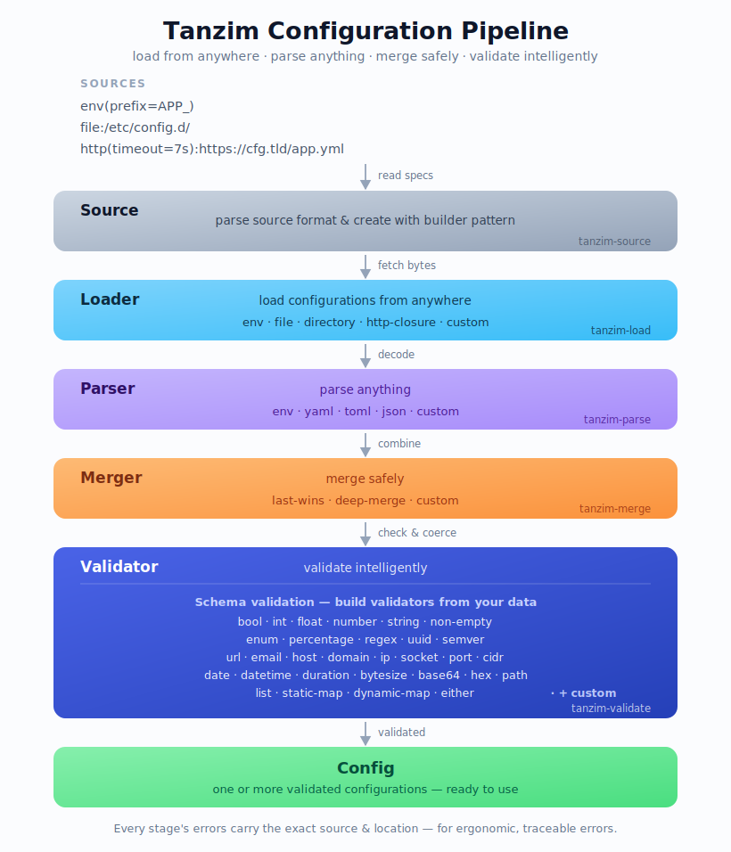

# tanzim



## Why
Real configuration never lives in one place or in one format. It arrives from environment variables, files, whole directories, and remote endpoints — written in env, YAML, TOML, or JSON — and it has to be combined with clear precedence and checked before anything trusts it. The usual answer is a pile of glue code stitched across several unrelated libraries, and somewhere in that pile a value quietly loses track of *where it came from*.

`tanzim` treats the whole thing as **one pipeline** instead of a pile of glue. A value flows from its source through every stage while carrying its origin the entire way, so when something is wrong the error can point at the exact file, line, and column that caused it.

## Principles

These are the properties of the project as a whole — the reasons the pieces fit together the
way they do. Each stage's own README covers the details of *how*.

- **Located everything.** Every value *and every error* remembers its exact source, line, and column. Errors render a caret-underlined snippet pointing straight at the offending input.
- **Pluggable at every stage.** Loading, parsing, merging, and validating are each just a trait. Bring your own source kind, format, merge strategy, or validator without forking anything.
- **Pay for what you use.** Every source, format, and validator is feature-gated. Take the whole pipeline through the facade, or depend on a single stage crate on its own.
- **Declarative sources.** Say *where* configuration comes from with short strings like `env(prefix=APP_)` or `file?:/etc/app` — not hand-wired setup code.
- **Validation is part of the pipeline.** Schema-driven checking and coercion is a first-class final stage, not something you bolt on afterward.
- **One config, or many.** Collapse everything into a single unified value, or keep named entries as a map — whichever fits how your application reads its configuration.

## Using in Rust

Describe your sources as strings, hand the pipeline a schema, and read back validated, merged configuration:

```rust,no_run
use tanzim::single::PipelineSingleBuilder;
use tanzim::merge::DeepMerge;
use tanzim::validate::{Either, Enum, IpAddr, Path, Port, StaticMap, Url, Value};

// Built here with the validator methods. The very same schema can instead be authored
// as data — YAML, JSON, TOML, anything serde reads — and deserialized into a `SchemaValue`.
let schema = StaticMap::new()
    .required("listen", StaticMap::new()               // { ip, port }
        .required("ip", IpAddr::new())
        .required("port", Port::new()))
    .required("remote", Url::new())                    // a URL
    .required("log", StaticMap::new()                  // { level: one of these }
        .required("level", Enum::new([
            Value::String("trace".into()),
            Value::String("debug".into()),
            Value::String("info".into()),
            Value::String("warn".into()),
            Value::String("error".into()),
        ])))
    .required("output", Either::new(                   // stdout / stderr, …
        Enum::new([Value::String("stdout".into()), Value::String("stderr".into())]),
        Path::new().writable(),                        // … or a writable file path
    ));

// `single` collapses every source into ONE unified configuration validated against a single
// schema. Prefer `tanzim::multi::PipelineMultiBuilder` when your sources describe SEVERAL named
// configurations: it keeps them separate, returning a map keyed by entry name, each validated
// against its own schema (`.with_schema(name, ...)`).
let config = PipelineSingleBuilder::new()
    .with_included_loaders()             // env · file · http
    .with_included_parsers()             // env · yaml · toml · json
    .with_merger(DeepMerge)
    .with_schema(schema)
    .with_source("env(prefix=APP_)")?
    .with_source("file:/etc/app.toml")?
    .with_source("http(insecure=true):https://cfg.tld/path/to/app.yaml")?
    .build()?
    .run()?;
```

Full walkthrough, features, and per-stage recipes → [crates.io](https://crates.io/crates/tanzim) · [docs.rs](https://docs.rs/tanzim).

## License

Licensed under [BSD-3-Clause](LICENSE).
